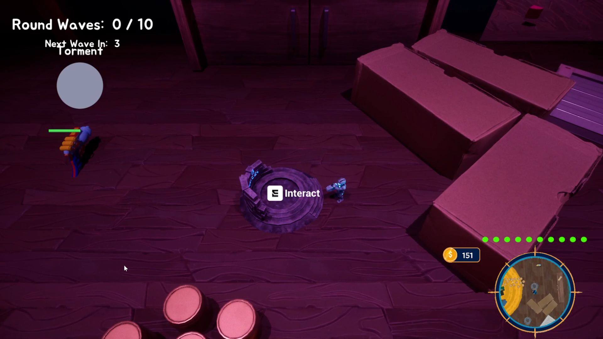
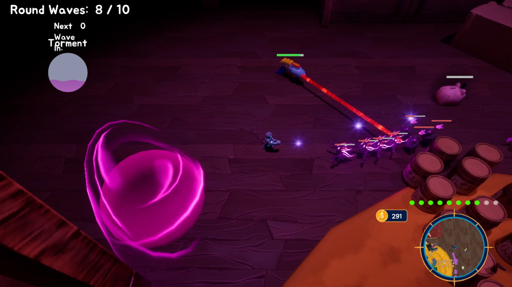
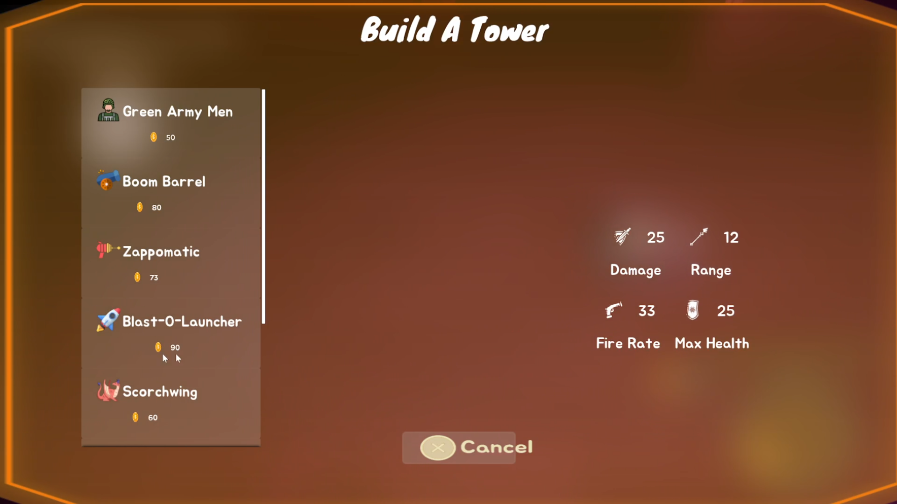

# Night Watch

*A Tower Defense Game for the Druid Mechanics Game Jam*

## Game Overview

Night has fallen, and you have a mission. As one of the child's beloved toys, you must defend your sleeping child from the nightmares that invade his room at night and try to torment his dreams. But you're not alone—you can enlist the help of other toys by building and using them as guard towers to help defend your perimeter and keep the nightmares at bay.

As the night progresses, the nightmares increase in number and become more aggressive, making survival increasingly challenging. See how long YOU can survive the night and protect your child's peaceful dreams.

**Genre:** Strategy | Tower Defense  
**Platform:** Windows  
**Engine:** Unreal Engine  
**Status:** Prototype  
**Game Jam:** Druid Mechanics Game Jam
**URL** [itch.io](https://rawrbigcat.itch.io/night-watch)

## Team & Roles

**Team Size:** 5 Developers

### Lead Developer & Project Manager
- **Role:** Lead Developer, Game System Designer, Level Designer, Project Manager, Team Leader
- **Responsibilities:** 
  - Led a 5-person development team through the entire game jam lifecycle
  - Designed and implemented core game systems and mechanics
  - Managed project timeline and coordinated team efforts
  - UI functionality and flow
  - Created engaging level designs and gameplay flow

### Team Members
- [RAWRBigCat](https://rawrbigcat.itch.io) - Developer
- [Hanzo](https://hanzo-hatachi.itch.io) - Developer  
- [Zerrissen91](https://zerrissen91.itch.io) - Developer
- [arnietorvall](https://arnietorvall.itch.io) - Artist
- [Haze](https://khazeh.itch.io) - Artist

## Features

### Core Gameplay
- **Tower Defense Mechanics:** Strategic placement of toy guard towers to defend against nightmares
- **Progressive Difficulty:** Nightmares increase in number and aggression as the night progresses
- **Resource Management:** Strategic decision-making for tower placement and upgrades
- **Defense Perimeter:** Protect the sleeping child from all directions

### Key Systems Designed
- **Upgrade System:** Comprehensive tower and defense upgrades to enhance effectiveness
- **Interaction System:** Intuitive controls for building, upgrading, and managing defenses
- **Level Design:** Carefully crafted levels that provide strategic depth and challenge
- **Progressive Scaling:** Dynamic difficulty that keeps players engaged throughout the night

## Technologies Used

- **Unreal Engine 5.6** - Primary game engine
- **Blueprints** - Visual scripting for rapid prototyping

## Development Journey

This project was developed as part of the Druid Mechanics Game Jam 2025, representing a collaborative effort to create an engaging tower defense experience with a unique narrative twist. As the lead developer and project manager, I orchestrated the development process from initial concept to final prototype.

### Key Achievements
- Successfully delivered a complete playable prototype within the game jam timeframe
- Implemented complex upgrade and interaction systems that enhance player engagement
- Designed levels that provide both strategic depth and accessible gameplay
- Led a diverse team of 5 developers through effective project management

### Challenges Overcome
- Coordinating team efforts across different time zones and skill levels
- Balancing tower defense mechanics with the unique "toy defending child" narrative
- Implementing progressive difficulty scaling that maintains challenge without frustration
- Rapid prototyping and iteration within the game jam constraints

## How to Play

1. **Objective:** Protect the sleeping child from nightmares throughout the night
2. **Building:** Place toy guard towers strategically around the room perimeter
3. **Upgrading:** Use resources to upgrade towers for increased effectiveness
4. **Strategy:** Plan your defense carefully as nightmares become more numerous and aggressive
5. **Survival:** See how long you can last against the increasing nightmare onslaught

### Controls
- **Mouse:** Navigate and select towers
- **Mouse:** Shoot primary weapon
- **Shift:** Use secondary ability
- **Space:** Dash
- **E:** Place towers on the battlefield
- **E:** Upgrade existing towers

## Screenshots & Media

## Download & Play

**Download the game:** [Night Watch on itch.io](https://rawrbigcat.itch.io/night-watch)

- **File Size:** 788 MB
- **Platform:** Windows
- **Version:** 1.0.2

## Future Plans

### Short-term Goals
- Implement additional tower types with unique abilities
- Add more diverse nightmare enemy types
- Create multiple room environments for varied gameplay
- Polish UI/UX based on player feedback

### Long-term Vision
- Expand the narrative with multiple nights and story progression
- Add multiplayer cooperative mode
- Implement achievement system and leaderboards
- Consider mobile platform adaptation

## Development Insights

This project provided valuable experience in:
- **Team Leadership:** Managing a diverse team under tight time constraints
- **System Design:** Creating engaging upgrade and interaction mechanics
- **Level Design:** Balancing difficulty progression with player engagement
- **Rapid Prototyping:** Delivering a complete experience within game jam limitations
- **Project Management:** Coordinating multiple developers and maintaining project momentum

## Acknowledgments

Special thanks to the entire development team for their dedication and creativity throughout the Druid Mechanics Game Jam. This project represents the power of collaborative game development and the importance of clear communication and shared vision in creating engaging player experiences.

---

*Developed with ❤️ for the Druid Mechanics Game Jam*